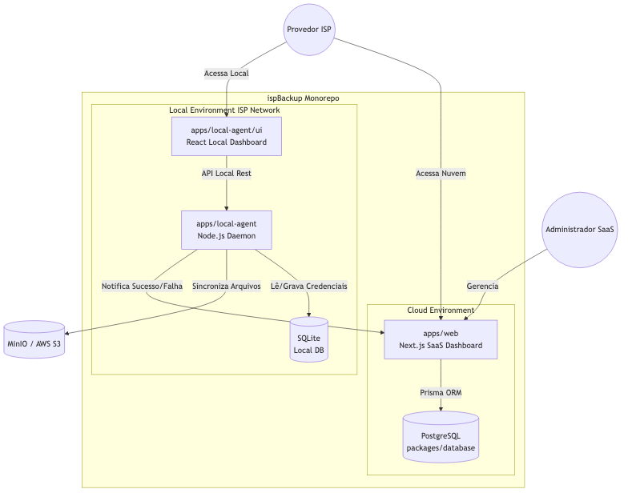
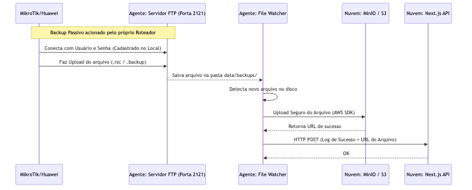
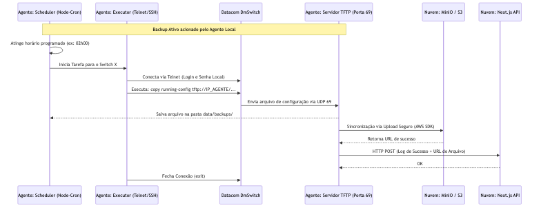

# Arquitetura do Sistema ispBackup

Este documento apresenta a arquitetura geral da plataforma ispBackup, detalhando como os módulos interagem entre si e o fluxo de dados durante a execução de um backup.

---

## 1. Visão Geral da Arquitetura (Como os Apps se Conectam)

O sistema segue uma arquitetura Híbrida:
- Um **SaaS (Nuvem)** que gerencia provedores (Tenants) e consolida os logs.
- Um **Agente Local (Zero Trust)** instalado na rede de cada provedor, focado na segurança das credenciais e na coleta dos arquivos.

---

## 2. Caso de Uso: Fluxo de Backup (Ativo vs Passivo)

O Agente Local foi projetado para suportar diferentes "sabores" de equipamentos, lidando tanto com roteadores modernos que sabem enviar backups sozinhos (Passivo) quanto equipamentos limitados que precisam ser forçados a fazer o backup (Ativo).

### 2.1 Modelo Passivo (Ex: MikroTik / Huawei)
Neste modelo, o roteador do cliente possui uma tarefa agendada (Cron interno) que gera e empurra o backup via FTP.

### 2.2 Modelo Ativo (Ex: Datacom via TFTP)
Neste modelo, o equipamento é limitado (não tem agendador ou só suporta TFTP). O Agente Local precisa acordar de madrugada, invadir o equipamento via SSH/Telnet e forçar a cópia.

## Resumo da Arquitetura Zero Trust
Como visível nos diagramas acima, as credenciais e senhas dos roteadores ficam estritamente contidas no banco `SQLite` local. O `AgentUI` lê essas senhas, o `Agent` usa essas senhas, mas a comunicação com a nuvem (`Web` e `DB` na Nuvem) trafega apenas metadados (Logs de Sucesso/Falha) e o arquivo em si (armazenado no `S3`). A Nuvem não sabe as senhas dos roteadores.
